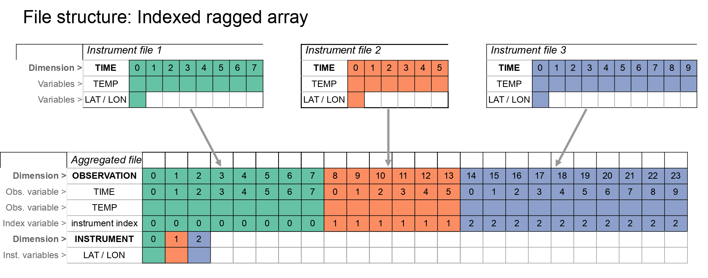
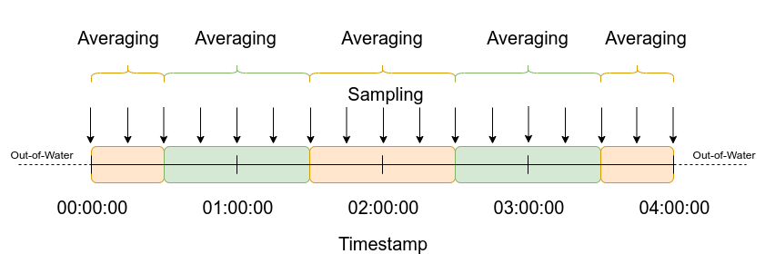

## HOW-TO: get information from LTSP files

<a id='TOC'></a>
### Table of Contents

* [Introduction](#ZERO)
* [File Types](#ONE)
* [File Format](#TWO)
* [Getting the File Name](#THREE)
* [Hourly Product INFO](#FOUR)
* [Gridded Product INFO](#FIVE)


<a name="ZERO"></a>
### INTRODUCTION

----------------------- 

IMOS-AODN regularly publish a set of products that combine and aggregate the values of the oceanographic variables collected at the ANMN mooring arrays. Normally, every deployment from each of the instruments are stored in individual files and that makes difficult to analyse different deployments and/or parameter together. 

This guide shows how to use a set of functions that allows to discover the LTSP files and extract some information valuable for future analysis.

<a name="ONE"></a> 
### FILE TYPES

----------------------
[back to TOC](#TOC)  

IMOS LTSP comprises five different products: 

- Non-velocity products (exclude all velocity related parameters):
    - Aggregated file: one parameter aggregated into one file with all the deployments from a site. 
    - Hourly aggregated file: all parameters from all instruments deployed at one site, aggregated (mean or median depending on the parameter) into one-hour bins. This product has two variants: one that includes only good-quality data and another with all the data, disregarding the QC performed on the values.
    - Gridded aggregated. Only Temperature. The file contains a regular grid of interpolated temperature values in the water column. The depth intervals depend on the location of the instruments in the mooring array.
    
- Velocity products (only water current components):
    - Aggregated file: velocity related parameters (u, v, w and scalar water speed) aggregated into one file with all the deployments from a site. 
    - Hourly aggregated file: velocity related parameters (u, v, w and scalar water speed) from all instruments deployed at one site, aggregated (mean or median depending on the parameter) into one-hour bins. This product has two variants: one that includes only good-quality data and another with all the data, disregarding the QC performed on the values.
    
<a name="TWO"></a> 
### FILE FORMAT 

-------------------------
[back to TOC](#TOC)  


Normally, every instrument recovered from a mooring array represents an individual file in the [IMOS THREDDS server](http://thredds.aodn.org.au/thredds/catalog/IMOS/ANMN/catalog.html). This characteristic that facilitates the individual quality control and metadata handling pose some challenges for the analysis of long time series: 

- Many files for one time series
- Instruments deployed to varying depths
- Instruments sample at different times
- Significant work and expert knowledge required to view and analyse time series
- Different user groups need different products (gridded density, MLD, data combined from multiple sources, plots, etc…)

The hourly aggregated product is a file that aggregates all the variables from one site into one-hour bins. 

The aggregated file is a netCDF 4 file organised in an [Indexed Ragged Array](http://cfconventions.org/cf-conventions/v1.6.0/cf-conventions.html#_indexed_ragged_array_representation) structure that follows the Climate-Forecast conventions and IMOS netCDF file conventions (*diagram by M. Hidas*): 



Some characteristics of this structure:

- `TIME` is no longer a dimension. That means that the ordinary selecting and plotting methods for CF netCDF are no longer available. `TIME` is one of the variables in the file.
- the dimensions of the file are `OBSERVATION` and `INSTRUMENT`. As the aggregation process combine instruments that normally have common timestamps, the time variable could have repeated values. Also each deployment (instrument) is identified by and index and the compound instrument name, make, serial. In this way it is easy to filter according to specific instruments.


The aggregation takes the variable values half an hour before the hour and half an hour after the hour and reduce the variable values by calculating the mean or the median. Additional variables resulting from the aggregation process are also available in the file, as ancillary variables.



<a name="THREE"></a>
### GETTING THE FILE NAME

------------------------
[back to TOC](#TOC)  

One of the characteristics of the IMOS file naming convention is that the creation date is part of the file name. 
That means that every time the IMOS-AODN automatic pipeline produces a new aggregated file for a site, 
the old file will be replaced by a new one with **a different name**. 
This could represent a challenge to access the file programatically, and normally you need to go to the AODN THREDDS 
server and look for the new file name. 

The function `getLTSPname.py` helps you to discover the name of the most recent aggregated file. 
It requires the name of the site (`site`, like GBRCCH or NRSYON), 
the type of product (`product`: 'aggregated', 'hourly', 'velocity', or 'gridded'), 
the `parameter` (only for `product='gridded'`, like 'TEMP' or 'velocity'), 
and the root of the URL `webURL`: 'S3': Amazon AWS (to download, fastest), 
'opendap' AODN THREDDS (to open remotely) or 'wget' to download.

It returns the file name with the appropriate web prefix

`python getLTSPname.py`
```
usage: getLTSPname.py [-h] -site SITE -product PRODUCT [-QC QC] [-param PARAM]
                      [-weburl WEBURL]

Get LTSP file name

optional arguments:
  -h, --help        show this help message and exit
  -site SITE        site code, like NRMMAI
  -product PRODUCT  product type: aggregated, hourly, velocity-hourly or
                    gridded
  -QC QC            for the hourly, QCed data only. Default True
  -param PARAM      for the aggregated, parameter, like TEMP, or "velocity"
  -weburl WEBURL    url root for the file: S3: Amazon AWS (for download,
                    fastest), wget (AODN THREDDS, for download), opendap (AODN
                    THREDDS to open remotely). Default opendap

```

Examples: 

*Aggregated product:* 

```buildoutcfg
python getLTSPname.py -site NRSYON -product aggregated -param TEMP
http://thredds.aodn.org.au/thredds/dodsC/IMOS/ANMN/NRS/NRSYON/aggregated_timeseries/IMOS_ANMN-NRS_TZ_20080623_NRSYON_FV01_TEMP-aggregated-timeseries_END-20200804_C-20210428.nc
```

*Hourly product:* 

```buildoutcfg
python getLTSPname.py -site GBRCCH -product hourly
http://thredds.aodn.org.au/thredds/dodsC/IMOS/ANMN/QLD/GBRCCH/hourly_timeseries/IMOS_ANMN-QLD_BOSTZ_20070910_GBRCCH_FV02_hourly-timeseries_END-20201215_C-20210428.nc
```

*Velocity product:* 

```buildoutcfg
python getLTSPname.py -site GBRMYR -product velocity-hourly
http://thredds.aodn.org.au/thredds/dodsC/IMOS/ANMN/QLD/GBRMYR/hourly_timeseries/IMOS_ANMN-QLD_VZ_20071030_GBRMYR_FV02_velocity-hourly-timeseries_END-20200731_C-20210222.nc
```

*Gridded product:*

```buildoutcfg
python getLTSPname.py -site NRSKAI -product gridded
http://thredds.aodn.org.au/thredds/dodsC/IMOS/ANMN/NRS/NRSKAI/gridded_timeseries/IMOS_ANMN-NRS_TZ_20080212_NRSKAI_FV02_TEMP-gridded-timeseries_END-20201123_C-20210426.nc
```

<a name="FOUR"></a>
### INFO FROM **HOURLY** LTSP

-----------------------------
[back to TOC](#TOC)  


As it was mentioned before, the hourly aggregated product contains all the variables (non-velocity or velocity) from all the instruments from one site. Normally, those files are much smaller than the aggregaged files, as the variables have been summarised into one hour time bins. However, it would be useful to obtain the metadata of the file as well as the variables that contains. The function `infoLTSPh` will return a summary of the hourly file. The function is available in the infoLTSP.py file:

Example: 

```buildoutcfg
infoLTSPh('GBRCCH')
Site                    GBRCCH
Sub-Facility:           thredds.aodn.org.au
Filename for download:  http://thredds.aodn.org.au/thredds/dodsC/IMOS/ANMN/QLD/GBRCCH/hourly_timeseries/IMOS_ANMN-QLD_BOSTZ_20070910_GBRCCH_FV02_hourly-timeseries_END-20201215_C-20210428.nc
Location:               -22.3178 - 151.89985
Time coverage:          2007-09-10T07:00:00Z thru 2020-12-15T00:00:00Z
Min DEPTH:              5.2
Max DEPTH:              132.7
DATA variables:         DEPTH, CHLU, CPHL, DOX, DOX1, DOX2, PRES, PSAL, TEMP
Number of Instruments   178
DEPTH                   ▓▓▓▓▓▓▓▓▓░░░░░░░░░░░▓▓▓▓▓▓▓▓▓▓▓▓▓▓▓▓▓▓▓▓▓▓▓▓▓▓▓▓▓▓▓▓▓▓▓▓▓▓▓▓▓▓▓▓▓▓▓▓▓▓▓▓▓▓▓▓▓▓▓▓
CHLU                    ░░░░░░░░░░░░░░░░░░░░░░░░░░░░░░░░░░░░░░░░░░░░░░░░░░░░░░░░░░░░░░░░░░░░░░░░░░░░░░░░
CPHL                    ░░░░░░░░░░░░░░░░░░░░░░░░░░░░░░░░░░░▓░░░░▓░░░░░░░░▓░░░░░░░░▓░░░░░░░░░░░░▓░░░░░░░░
DOX                     ░░░░░░░░░░░░░░░░░░░░░░░░░░░░░░░░░░░░░░░░░░░░░░░░░░░▓░░░░░░░▓░░░░░░░░░░░░▓░░░░░░░
DOX1                    ░░░░░░░░░░░░░░░░░░░░░░░░░░░░░░░░░░░░░░░░░░░░░░░░░░░▓░░░░░░░▓░░░░░░░░░░░░▓░░░░░░░
DOX2                    ░░░░░░░░░░░░░░░░░░░░░░░░░░░░░░░░░▓░░░░░▓░░░░░░░░░▓░░░░░░░░▓░░░░░░░░░░░░▓░░░░░░░░
PRES                    ░░░░░░░░░░░░░░░░░░░░░░░░░░░░░░░░░░░░░░░░░░░░░░░░░░░░░░░░░░░░░░░░░░░░░▓░▓░░░░░░░░
PSAL                    ░░░░░░░░░░░░░░░░░░░░░▓░░░░░░░░░░░░▓░░░░░▓░░░░░░░░░▓░░░░░░░░▓░░░░░░░░░░░░▓░░▓▓░░░
TEMP                    ▓▓▓▓▓▓▓▓░░░░░░░░▓▓▓▓▓▓▓▓▓▓▓▓▓▓▓▓▓▓▓▓▓▓▓▓▓▓▓▓▓▓▓▓▓▓▓▓▓▓▓▓▓▓▓▓▓▓▓▓▓▓▓▓▓░▓▓▓▓▓▓▓▓▓▓
░ NO DATA, ▓ DATA

```

The text plot shows approximately where the data is present for each variable in the range of time coverage. 

It is important to mention that, in addition to the standard parameters, the aggregated file also contains ancilary variables derived from the binning process: count, minimum and maximum value and standard deviation in each hourly interval. These variables are not included in the report. 

It is possible to have information about the instruments aggregated in the hourly file, using the `infoInst=True` argument: 

```buildoutcfg
infoLTSPh('GBRCCH', infoInst=True)
Site                    GBRCCH
Sub-Facility:           thredds.aodn.org.au
Filename for download:  http://thredds.aodn.org.au/thredds/dodsC/IMOS/ANMN/QLD/GBRCCH/hourly_timeseries/IMOS_ANMN-QLD_BOSTZ_20070910_GBRCCH_FV02_hourly-timeseries_END-20201215_C-20210428.nc
Location:               -22.3178 - 151.89985
Time coverage:          2007-09-10T07:00:00Z thru 2020-12-15T00:00:00Z
Min DEPTH:              5.2
Max DEPTH:              132.7
DATA variables:         DEPTH, CHLU, CPHL, DOX, DOX1, DOX2, PRES, PSAL, TEMP
Number of Instruments   178
DEPTH                   ▓▓▓▓▓▓▓▓▓░░░░░░░░░░░▓▓▓▓▓▓▓▓▓▓▓▓▓▓▓▓▓▓▓▓▓▓▓▓▓▓▓▓▓▓▓▓▓▓▓▓▓▓▓▓▓▓▓▓▓▓▓▓▓▓▓▓▓▓▓▓▓▓▓▓
CHLU                    ░░░░░░░░░░░░░░░░░░░░░░░░░░░░░░░░░░░░░░░░░░░░░░░░░░░░░░░░░░░░░░░░░░░░░░░░░░░░░░░░
CPHL                    ░░░░░░░░░░░░░░░░░░░░░░░░░░░░░░░░░░░▓░░░░▓░░░░░░░░▓░░░░░░░░▓░░░░░░░░░░░░▓░░░░░░░░
DOX                     ░░░░░░░░░░░░░░░░░░░░░░░░░░░░░░░░░░░░░░░░░░░░░░░░░░░▓░░░░░░░▓░░░░░░░░░░░░▓░░░░░░░
DOX1                    ░░░░░░░░░░░░░░░░░░░░░░░░░░░░░░░░░░░░░░░░░░░░░░░░░░░▓░░░░░░░▓░░░░░░░░░░░░▓░░░░░░░
DOX2                    ░░░░░░░░░░░░░░░░░░░░░░░░░░░░░░░░░▓░░░░░▓░░░░░░░░░▓░░░░░░░░▓░░░░░░░░░░░░▓░░░░░░░░
PRES                    ░░░░░░░░░░░░░░░░░░░░░░░░░░░░░░░░░░░░░░░░░░░░░░░░░░░░░░░░░░░░░░░░░░░░░▓░▓░░░░░░░░
PSAL                    ░░░░░░░░░░░░░░░░░░░░░▓░░░░░░░░░░░░▓░░░░░▓░░░░░░░░░▓░░░░░░░░▓░░░░░░░░░░░░▓░░▓▓░░░
TEMP                    ▓▓▓▓▓▓▓▓░░░░░░░░▓▓▓▓▓▓▓▓▓▓▓▓▓▓▓▓▓▓▓▓▓▓▓▓▓▓▓▓▓▓▓▓▓▓▓▓▓▓▓▓▓▓▓▓▓▓▓▓▓▓▓▓▓░▓▓▓▓▓▓▓▓▓▓
░ NO DATA, ▓ DATA
  Instrument_index  Instrument id                                                     Coverage FROM    Coverage THRU    Data Availability
                 0  GBRCCH-0709; SEABIRD SBE39 - TEMPERATURE RECORDER; 1519           2007-09-10       2008-05-06       ▓▓░░░░░░░░░░░░░░░░░░░░░░░░░░░░░░░░░░░░░░
                 1  GBRCCH-0709; SEABIRD SBE39 - TEMPERATURE RECORDER; 0917           2007-09-10       2008-05-06       ▓▓░░░░░░░░░░░░░░░░░░░░░░░░░░░░░░░░░░░░░░
                 2  GBRCCH-0709; RDI ADCP - WORKHORSE SENTINEL-300; 9433              2007-09-10       2008-05-05       ▓▓░░░░░░░░░░░░░░░░░░░░░░░░░░░░░░░░░░░░░░
                 3  GBRCCH-0709; SEABIRD SBE39 - TEMPERATURE RECORDER; 0930           2007-09-10       2008-05-06       ▓▓░░░░░░░░░░░░░░░░░░░░░░░░░░░░░░░░░░░░░░
                 4  GBRCCH-0709; SEABIRD SBE39 - TEMPERATURE RECORDER; 1514           2007-09-10       2008-05-05       ▓▓░░░░░░░░░░░░░░░░░░░░░░░░░░░░░░░░░░░░░░
                 5  GBRCCH-0805; SEABIRD SBE37SM + P; 4477                            2008-05-06       2008-10-24       ░░▓░░░░░░░░░░░░░░░░░░░░░░░░░░░░░░░░░░░░░
                 6  GBRCCH-0805; SEABIRD SBE39 - TEMPERATURE RECORDER; 0930           2008-05-06       2008-10-24       ░░▓░░░░░░░░░░░░░░░░░░░░░░░░░░░░░░░░░░░░░
                 7  GBRCCH-0805; SEABIRD SBE39 - TEMPERATURE RECORDER; 1514           2008-05-06       2008-10-24       ░░▓░░░░░░░░░░░░░░░░░░░░░░░░░░░░░░░░░░░░░
                 8  GBRCCH-0805; RDI ADCP - WORKHORSE SENTINEL-300; 9433              2008-05-06       2008-10-24       ░░▓░░░░░░░░░░░░░░░░░░░░░░░░░░░░░░░░░░░░░
                 9  GBRCCH-0805; SEABIRD SBE39 - TEMPERATURE RECORDER; 0917           2008-05-06       2008-10-24       ░░▓░░░░░░░░░░░░░░░░░░░░░░░░░░░░░░░░░░░░░
                10  GBRCCH-0811; RDI ADCP - WORKHORSE SENTINEL-300; 9433              2008-11-02       2009-04-19       ░░░▓░░░░░░░░░░░░░░░░░░░░░░░░░░░░░░░░░░░░
...<output truncated>...
               170  GBRCCH-2006; SEABIRD SBE37SMP + P; 15593                          2020-06-15       2020-12-15       ░░░░░░░░░░░░░░░░░░░░░░░░░░░░░░░░░░░░░░▓▓
               171  GBRCCH-2006; SEABIRD SBE39PLUS P - TEMPERATURE & PRESSURE RECORD  2020-06-15       2020-12-15       ░░░░░░░░░░░░░░░░░░░░░░░░░░░░░░░░░░░░░░▓▓
               172  GBRCCH-2006; SEABIRD SBE56 - TEMPERATURE RECORDER; 07524          2020-06-15       2020-12-15       ░░░░░░░░░░░░░░░░░░░░░░░░░░░░░░░░░░░░░░▓▓
               173  GBRCCH-2006; SEABIRD SBE56 - TEMPERATURE RECORDER; 05178          2020-06-15       2020-12-15       ░░░░░░░░░░░░░░░░░░░░░░░░░░░░░░░░░░░░░░▓▓
               174  GBRCCH-2006; SEABIRD SBE56 - TEMPERATURE RECORDER; 00980          2020-06-15       2020-12-15       ░░░░░░░░░░░░░░░░░░░░░░░░░░░░░░░░░░░░░░▓▓
               175  GBRCCH-2006; SEABIRD SBE39 - TEMPERATURE RECORDER; 1058           2020-06-15       2020-12-15       ░░░░░░░░░░░░░░░░░░░░░░░░░░░░░░░░░░░░░░▓▓
               176  GBRCCH-2006; SEABIRD SBE39 - TEMPERATURE RECORDER; 1059           2020-06-15       2020-12-15       ░░░░░░░░░░░░░░░░░░░░░░░░░░░░░░░░░░░░░░▓▓
               177  GBRCCH-2006; RDI ADCP - WORKHORSE QUARTERMASTER; 16752            2020-06-15       2020-12-15       ░░░░░░░░░░░░░░░░░░░░░░░░░░░░░░░░░░░░░░▓▓
```

in this case, the block plot shows approximately, where the data from the instrument are in the time coverage range


<a name="FIVE"></a>
### INFO FROM **GRIDDED** LTSP

--------------------------------
[back to TOC](#TOC)  


The gridded product is arranged in a more conventional rectamgular way, having `TIME` and `DEPTH` as dimensions. That means that all the methods applied to these dimensions should work seamless. 

Similarly, it is also possible to obtain information from the gridded LTSP file using the function `infoLTSPg` from the `infoLTSP.py` file. In this case, only the site code is needed: 

```buildoutcfg
infoLTSPg('GBRMYR')
----------------------------  -------------------------------------------------------------------------------------------------------------------------------------------------------------------------------
Site                          GBRMYR
Sub-Facility:                 thredds.aodn.org.au
Filename for download:        https://s3-ap-southeast-2.amazonaws.com/imos-data/IMOS/ANMN/QLD/GBRMYR/hourly_timeseries/IMOS_ANMN-QLD_BOSTUZ_20071030_GBRMYR_FV02_hourly-timeseries_END-20200730_C-20210428.nc
Filename for connection:      http://thredds.aodn.org.au/thredds/dodsC/IMOS/ANMN/QLD/GBRMYR/hourly_timeseries/IMOS_ANMN-QLD_BOSTUZ_20071030_GBRMYR_FV02_hourly-timeseries_END-20200730_C-20210428.nc
Location:                     -18.22087 - 147.34962
Time coverage:                2007-10-30T11:00:00Z through 2020-07-30T00:00:00Z
Max DEPTH:                    210
Included DEPTHS:              0.0, 10.0, 20.0, 30.0, 40.0, 50.0, 60.0, 70.0, 80.0, 90.0, 100.0, 110.0, 120.0, 130.0, 140.0, 150.0, 160.0, 170.0, 180.0, 190.0, 200.0, 210.0
Data Availability at 0.0m:    ░░░░░░░░░░░░░░░░░░░░░░░░░░░░░░░░░░░░░░░░
Data Availability at 10.0m:   ░░░░░░░░░░░░░░░░░░░░░░░▓▓▓░░░░░░░░░░░░░░
Data Availability at 20.0m:   ░░░░░░░░░░░░░░░░░░▓▓▓▓▓▓▓▓▓░░░░░░░░▓▓░░░
Data Availability at 30.0m:   ░░░░░░░░░░░░░░░▓▓▓▓▓▓▓▓▓▓▓▓▓▓▓▓▓▓▓▓▓▓▓▓▓
Data Availability at 40.0m:   ░░░░░░░░░░░░░░░▓▓▓▓▓▓▓▓▓▓▓▓▓▓▓▓▓▓▓▓▓▓▓▓▓
Data Availability at 50.0m:   ░░░░░░▓░░░░░▓░░░░▓▓▓▓▓▓▓▓▓▓▓▓▓▓▓▓▓▓▓▓▓▓▓
Data Availability at 60.0m:   ░░░░░▓░░░░░░░░░░░░▓▓▓▓▓▓▓▓▓▓▓▓▓▓▓▓▓▓▓▓▓▓
Data Availability at 70.0m:   ░░░░░▓▓░░░░░░░░░░░░▓▓▓▓▓▓▓▓▓▓▓▓░░▓▓▓▓▓▓▓
Data Availability at 80.0m:   ░░░░░▓▓░░░░░░░░░░░░░▓▓▓▓▓▓▓▓▓▓▓▓▓▓▓▓▓▓▓▓
Data Availability at 90.0m:   ░░░░░▓▓░░░░░░░░░░░░▓▓▓▓▓▓▓▓▓▓▓▓▓▓▓▓▓▓▓▓▓
Data Availability at 100.0m:  ░░░░░▓▓░░░░░░░░░░░░▓▓▓▓▓▓▓▓▓▓▓▓▓▓▓▓▓▓▓▓▓
Data Availability at 110.0m:  ░░░░░░░░░░░░░░░░░░▓▓▓▓▓▓▓▓▓▓▓▓▓▓▓▓▓▓▓▓▓▓
Data Availability at 120.0m:  ░░░░░░░░░░░░░░░░░░▓▓▓▓▓▓▓▓▓▓▓▓▓▓▓▓▓▓▓▓▓▓
Data Availability at 130.0m:  ░░░░░░░░░░░░░░░░░░▓▓▓▓▓▓▓▓▓▓▓▓▓▓▓▓▓▓▓▓▓▓
Data Availability at 140.0m:  ░░░░░░░░░░░░░░░░░░▓▓▓▓▓▓▓▓▓▓▓▓▓▓▓▓▓▓▓▓▓▓
Data Availability at 150.0m:  ░░░░░░░░░░░░░░░░░░▓▓▓▓▓▓▓▓▓▓▓▓▓▓▓▓▓▓▓▓▓▓
Data Availability at 160.0m:  ░░░░░░░░░░░░░░░░░░░▓▓▓▓▓▓▓▓▓▓▓▓▓▓▓▓▓▓▓▓▓
Data Availability at 170.0m:  ░░░░░░░░░░░░░░░░░░░▓▓▓▓▓▓▓▓▓▓▓▓▓▓▓▓▓▓▓▓▓
Data Availability at 180.0m:  ░░░░░░░░░░░░░░░░░░░▓▓▓▓▓▓▓▓▓▓▓▓▓▓▓▓▓▓▓▓▓
Data Availability at 190.0m:  ░░░░░░░░░░░░░░░░░░▓▓▓▓▓▓▓▓▓▓▓▓▓▓▓▓▓▓▓▓▓▓
Data Availability at 200.0m:  ░░░░░░░░░░░░░░░▓▓░░░░░░░░░░▓▓▓▓▓▓▓▓▓▓▓▓▓
Data Availability at 210.0m:  ░░░░░░░░░░░░▓▓░░░░░░░░░░░░░░░░░░░░░░░▓▓░
----------------------------  -------------------------------------------------------------------------------------------------------------------------------------------------------------------------------
░ NO DATA, ▓ DATA
```

In this case, the block plot shows the data availability in the water column in the time coverage range.